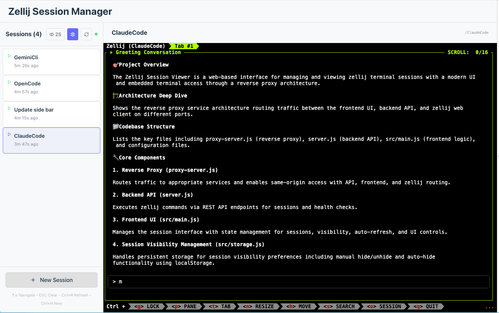

# Zellij Multi-Session Viewer (ZViewer)

A comprehensive web-based session management interface for zellij terminal multiplexer. This application provides a modern, intuitive interface to view, navigate, and manage your zellij sessions with embedded terminal access. Perfect for Claude Code, Gemini Cli, OpenCode and more. 



**✅ Straight to the point**: 

Clone it first

then
```bash
npm install
   ```
then create zellij web token
   ```bash
zellij web --create-token
   ```

then start zellij web
```bash
zellij web --port 8083
   ```
then start all dev servers
 ```bash
npm run dev-proxy
   ```
Navigate to `http://localhost:4000/zviewer/`

### Important Note:
 Safari and other browsers require HTTPS for auth. Cloudflare Quicktunnels are the fastest way to get up and running:
Very easy to setup 
https://developers.cloudflare.com/cloudflare-one/connections/connect-networks/do-more-with-tunnels/trycloudflare/

after installing cloudflared then
```bash
cloudflared tunnel --url http://localhost:8080
   ```

### Tip:
Zellij's Web Client is fairly new. Get familiar with it first, for the best understanding of the experience.
https://zellij.dev/documentation/web-client.html 


## 🚀 Features

### 🖥️ **Integrated Terminal Access**
- **Embedded Web Client**: Full zellij terminal interface in your browser
- **Session Navigation**: Click any session to view it instantly
- **Seamless Switching**: Switch between sessions with smooth transitions
- **Direct Terminal Control**: Full keyboard and mouse support in embedded terminals

### 📋 **Session Management**
- **Real-time Session List**: View all active zellij sessions with live updates
- **Status Indicators**: Visual distinction between active, exited, and selected sessions
- **Auto-refresh**: Automatic session list updates every 30 seconds
- **Session Metadata**: Display creation times and session status

### ⌨️ **Enhanced User Experience**
- **Keyboard Navigation**: Arrow keys to navigate, Ctrl+R to refresh, ESC to clear
- **Responsive Design**: Optimized for desktop, tablet, and mobile devices
- **Dark/Light Mode**: Automatic theme switching based on system preferences
- **Loading States**: Smooth transitions and visual feedback
- **Error Handling**: Graceful handling of offline sessions and network issues

### 🎨 **Modern Interface**
- **Sidebar Navigation**: Clean session list with status indicators
- **Grid Layout**: Responsive CSS Grid layout with collapsible sidebar
- **Visual Feedback**: Color-coded status dots and selection highlighting
- **Mobile Optimized**: Collapsible overlay sidebar for mobile devices

## 📋 Prerequisites

- **Node.js** (v14 or higher)
- **Zellij** terminal multiplexer installed and accessible via command line
- **npm** package manager
### **Important Notes**

- **Safari HTTPS Requirement**: Safari requires HTTPS for authentication to work properly in embedded sessions. Use [Cloudflare Quick Tunnels](https://developers.cloudflare.com/cloudflare-one/connections/connect-networks/do-more-with-tunnels/trycloudflare/) for external access.
- **Zellij Web Client**: This application leverages zellij's built-in web client. See the [official documentation](https://zellij.dev/documentation/web-client.html) for more details.

## 🛠️ Installation & Setup

### **Quick Start (Reverse Proxy - Recommended)**

1. **Clone/Navigate to the project directory**:
   ```bash
   cd zviewer
   ```

2. **Install dependencies**:
   ```bash
   npm install
   ```

3. **Start zellij web server**:
   ```bash
   zellij web --port 8083
   # Or use the npm script (respects ZELLIJ_PORT env var):
   npm run start:zellij
   ```

4. **Start all services**:
   ```bash
   npm run dev-proxy
   # Or start everything including zellij:
   npm run start:all
   ```

5. **Open in browser**:
   Navigate to `http://localhost:4000/zviewer/`

6. **For external access (tunneling)**:
   ```bash
   # In another terminal
   cloudflare tunnel --url localhost:4000
   # Then access via: https://your-tunnel.com/zviewer/
   ```

### **Alternative Setup (Direct Access)**

```bash
# Option 1: Run both backend and frontend together
npm run dev-full

# Option 2: Run separately (in different terminals)
npm run server    # Backend API on port 3001
npm run dev       # Frontend on port 5173
```

Then navigate to `http://localhost:5173`

### **Getting Started**
- Create some zellij sessions: `zellij --session mysession`
- Click any session in the sidebar to view it
- Use keyboard shortcuts for quick navigation

## 🎮 Usage Guide

### **Session Navigation**
- **Click** any session in the left sidebar to view it
- **Arrow Keys** (↑↓) to navigate between sessions
- **Enter** to select highlighted session
- **Escape** to deselect current session and return to welcome screen

### **Refresh & Updates**
- **Ctrl+R** (or Cmd+R on Mac) to manually refresh session list
- **Auto-refresh** indicator shows live updates every 30 seconds
- **Refresh button** (↻) in sidebar header for manual refresh

### **Visual Indicators**
- 🟢 **Green dot**: Active session
- 🔴 **Red dot**: Exited session (can be resurrected)
- 🔵 **Blue highlight**: Currently selected/viewing session
- 🟢 **Pulsing dot**: Auto-refresh active

### **Mobile Usage**
- **Hamburger menu** (☰) to toggle sidebar on mobile
- **Responsive design** adapts to screen size
- **Touch-friendly** interface for mobile devices

## 🏗️ Architecture

### **Reverse Proxy Architecture (Production)**
```
Single Domain: https://your-app.com
├── /              → Zellij Web Client (port 8083)
├── /zviewer/      → Session Manager UI (port 5173)
└── /zviewer/api/  → Backend API (port 3001)
```

**Benefits:**
- ✅ Same-origin authentication (no CORS issues)
- ✅ Embedded sessions work perfectly in iframes
- ✅ Professional URL structure
- ✅ Single tunnel/domain required

### **Application Layout**
```
┌─────────────────────────────────────────────────────────────┐
│ Header: Zellij Session Manager                    [≡] [↻]  │
├──────────────┬──────────────────────────────────────────────┤
│ Sidebar      │ Main Content Area                            │
│ 300px        │ flex-grow                                    │
│              │                                              │
│ ┌──────────┐ │ ┌──────────────────────────────────────────┐ │
│ │●Session1 │ │ │ Session Header: session-name             │ │
│ │ Session2 │ │ ├──────────────────────────────────────────┤ │
│ │ Session3 │ │ │ <iframe src="/session1">                 │ │
│ └──────────┘ │ │                                          │ │
│              │ │ [Full Zellij Web Terminal]               │ │
│ [+ New]      │ │                                          │ │
│ [Refresh]    │ │                                          │ │
└──────────────┴──────────────────────────────────────────────┘
```

### **Services Overview**

#### **Reverse Proxy Server**
- **Port**: 4000
- **File**: `proxy-server.js`
- **Purpose**: Routes traffic to appropriate services, enables same-origin access

#### **Backend API (Node.js + Express)**
- **Port**: 3001
- **File**: `server.js`
- **Purpose**: Executes zellij commands and provides REST API

#### API Endpoints
- `GET /api/sessions` - Returns list of zellij sessions with metadata
- `GET /api/health` - Health check endpoint

#### Session Data Format
```json
{
  "success": true,
  "sessions": [
    {
      "name": "session-name",
      "createdAgo": "2h 30m",
      "status": "active",
      "raw": "session-name [Created 2h 30m ago]"
    }
  ],
  "count": 1
}
```

#### **Frontend (Vanilla JavaScript + Vite)**
- **Port**: 5173 (development)
- **Files**: `src/main.js`, `src/style.css`, `index.html`
- **Purpose**: Session management interface with embedded terminal access

#### **Zellij Web Server**
- **Port**: 8083 (configurable)
- **Purpose**: Serves zellij terminal interface and session access

#### Key Components
- **Sidebar**: Session list with navigation and controls
- **Main Content**: Embedded zellij web client via iframe
- **State Management**: Centralized app state with session tracking
- **Event Handling**: Keyboard shortcuts and click navigation

### **Integration Points**

#### **Reverse Proxy Mode (Recommended)**
- **Proxy Server**: `http://localhost:4000` (tunneled for external access)
- **Session Manager**: `http://localhost:4000/zviewer/`
- **Zellij Sessions**: `http://localhost:4000/{sessionName}`
- **API Endpoints**: `http://localhost:4000/zviewer/api/*`

#### **Direct Mode (Development)**
- **Zellij Web Server**: `http://127.0.0.1:8082` (auto-started by zellij)
- **Session URLs**: `http://127.0.0.1:8082/{sessionName}`
- **CORS**: Enabled by zellij web server for iframe embedding

## 📁 Project Structure

```
zviewer/
├── README.md                    # Main documentation
├── .env.example                 # Environment variables template ⭐
├── DEPLOYMENT_OPTIONS.md        # Comprehensive deployment guide
├── REVERSE_PROXY_SETUP.md       # Reverse proxy setup instructions
├── SUCCESS_SUMMARY.md           # Working solution overview
├── ENVIRONMENT_VARIABLES_PLAN.md # Configuration roadmap
├── IMPLEMENTATION_PLAN.md       # Technical implementation details
├── package.json                 # Dependencies and scripts
├── server.js                    # Backend Express server
├── proxy-server.js              # Reverse proxy server ⭐
├── vite.config.js               # Vite configuration
├── index.html                   # Main HTML file
├── zellij-info.md              # Zellij command reference
├── docs/
│   └── DEVELOPER_GUIDE.md      # 👨‍💻 Comprehensive developer guide
├── src/
│   ├── main.js                 # Frontend application logic
│   ├── style.css               # Responsive styling and themes
│   ├── counter.js              # Legacy file (unused)
│   └── javascript.svg          # Legacy file (unused)
└── public/
    └── vite.svg                # Vite logo
```

## 🎨 Key Features Breakdown

### **Session Management**
- **Live Session List**: Real-time display of all active zellij sessions
- **Status Tracking**: Visual indicators for session health and state
- **Quick Navigation**: One-click session switching
- **Auto-refresh**: Background updates every 30 seconds

### **Terminal Integration**
- **Embedded Access**: Full zellij web client embedded via iframe
- **Session-specific URLs**: Direct links to individual sessions
- **Seamless Experience**: No need to switch between applications
- **Full Functionality**: Complete terminal features within the browser

### **User Interface**
- **Responsive Layout**: CSS Grid-based layout that adapts to screen size
- **Keyboard Shortcuts**: Power-user features for quick navigation
- **Visual Feedback**: Loading states, error handling, and status indicators
- **Mobile Support**: Touch-friendly interface with collapsible sidebar

## 🎨 UI Components

### Session Grid
- **Layout**: Responsive CSS Grid
- **Cards**: Individual session information cards
- **Hover Effects**: Interactive feedback on hover

### Session Card Elements
- **Session Name**: Primary identifier
- **Creation Time**: "Created X ago" format
- **Status Badge**: Shows if session is exited/inactive

### Controls
- **Refresh Button**: Manual session list update
- **Loading Indicator**: Shows during API calls

## 🔧 Configuration

### Environment Variables

The application supports comprehensive environment variable configuration for flexible deployment:

#### **Default Configuration (No Setup Required)**
```bash
# Just run - uses built-in defaults
npm run dev-proxy
```

#### **Custom Configuration**
```bash
# Copy example configuration
cp .env.example .env

# Edit .env file with your preferred settings
PROXY_PORT=4001              # Reverse proxy port (default: 4000)
BACKEND_PORT=3002            # Backend API port (default: 3001)  
FRONTEND_PORT=5174           # Frontend dev server port (default: 5173)
ZELLIJ_PORT=9001             # Zellij web server port (default: 8083)

# Run with custom configuration
npm run dev-proxy
```

#### **Available Environment Variables**

**Service Ports:**
- `PROXY_PORT=4000` - Reverse proxy server port
- `BACKEND_PORT=3001` - Backend API server port
- `FRONTEND_PORT=5173` - Frontend dev server port
- `ZELLIJ_PORT=8083` - Zellij web server port

**Service Hosts:**
- `PROXY_HOST=localhost` - Reverse proxy bind host
- `BACKEND_HOST=localhost` - Backend API host
- `FRONTEND_HOST=localhost` - Frontend dev server host
- `ZELLIJ_HOST=127.0.0.1` - Zellij web server host

**Application Paths:**
- `FRONTEND_BASE_PATH=/zviewer` - Frontend base path for reverse proxy
- `API_BASE_PATH=/zviewer/api` - API base path for reverse proxy

**Frontend Variables (VITE_ prefix):**
- `VITE_API_BASE_PATH=/zviewer/api` - API endpoint path
- `VITE_SESSION_REFRESH_INTERVAL=30` - Auto-refresh interval in seconds

#### **Use Cases**

**Team Development (avoid port conflicts):**
```bash
# Developer A
PROXY_PORT=4001
BACKEND_PORT=3002
FRONTEND_PORT=5174

# Developer B  
PROXY_PORT=4002
BACKEND_PORT=3003
FRONTEND_PORT=5175
```

**Production Deployment:**
```bash
PROXY_PORT=80
NODE_ENV=production
DEBUG=false
```

**Custom Zellij Setup:**
```bash
ZELLIJ_PORT=9001
npm run start:zellij  # Starts zellij web server with custom port
```

### Zellij Integration
The application uses the recommended zellij command:
```bash
zellij list-sessions --no-formatting
```

This provides clean, parseable output in the format:
```
session_name [Created time_ago ago] [optional_status]
```

## 🐛 Troubleshooting

### **Common Issues**

1. **"No sessions found" when sessions exist**
   - Ensure zellij is installed and in PATH: `which zellij`
   - Check that zellij sessions are actually running: `zellij list-sessions`
   - Verify zellij web server is running: `zellij web --status`

2. **Session iframe not loading**
   - Check if zellij web server is online: `curl http://127.0.0.1:8082`
   - Verify session exists: `zellij list-sessions | grep session-name`
   - Check browser console for iframe errors

3. **Backend connection errors**
   - Verify backend is running on port 3001: `curl http://localhost:3001/api/health`
   - Check for port conflicts: `lsof -i :3001`
   - Ensure CORS is properly configured

4. **Frontend not loading**
   - Verify frontend is running on port 5173
   - Check browser console for JavaScript errors
   - Ensure all dependencies are installed: `npm install`

5. **Auto-refresh not working**
   - Check browser console for API errors
   - Verify backend is responding: `curl http://localhost:3001/api/sessions`
   - Check if auto-refresh indicator is pulsing (green dot in sidebar)

### **Debug Mode**
The server logs detailed information about session parsing. Check the server terminal for:
- Raw zellij command output
- Parsed session data
- API request logs
- Error messages and stack traces

### **Performance Tips**
- Close unused sessions to improve performance
- Use keyboard shortcuts for faster navigation
- Enable auto-refresh for real-time updates
- Use mobile view on smaller screens for better experience

## ⚡ Performance & Limitations

### **Current Capabilities**
- ✅ **Real-time Session Viewing**: Full terminal access via embedded web client
- ✅ **Auto-refresh**: Automatic session list updates every 30 seconds
- ✅ **Session Navigation**: Click-to-switch between sessions
- ✅ **Responsive Design**: Works on desktop, tablet, and mobile
- ✅ **Keyboard Shortcuts**: Power-user navigation features
- ✅ **Status Indicators**: Visual feedback for session states

### **Current Limitations**
- ⏳ **Session Creation**: Cannot create new sessions from UI (coming soon)
- ⏳ **Session Management**: Cannot delete or rename sessions from UI
- ⏳ **Bulk Operations**: No multi-session selection or operations
- 🔒 **Local Only**: Only works with local zellij sessions (by design)
- 🔒 **Single User**: Designed for single-user local development

### **Performance Notes**
- **Memory Usage**: Minimal overhead, iframes are loaded on-demand
- **Network**: Only API calls for session list, terminal data via zellij web server
- **Refresh Rate**: 30-second auto-refresh balances freshness with performance
- **Mobile**: Optimized for touch interfaces with responsive design

## 🔮 Future Enhancements

### **Technical Roadmap**

#### **✅ Completed Implementation**
- **Layout Architecture**: CSS Grid-based responsive layout
- **Session Navigation**: Click-to-switch with keyboard shortcuts
- **Iframe Integration**: Embedded zellij web client
- **Status Indicators**: Visual feedback for session states
- **Auto-refresh**: Background updates every 30 seconds
- **Error Handling**: Graceful degradation and error screens
- **Mobile Support**: Responsive design with collapsible sidebar

#### **🔄 Current Architecture**
```javascript
App State: {
  sessions: Session[],           // Live session data from API
  selectedSession: Session|null, // Currently viewed session
  loading: boolean,             // Loading state for transitions
  sidebarCollapsed: boolean,    // Mobile sidebar state
  error: string|null,          // Error handling
  autoRefresh: boolean,        // Auto-refresh toggle
  refreshInterval: number      // Refresh timer ID
}

UI Components:
├── App Container (CSS Grid Layout)
├── Sidebar (300px, collapsible)
│   ├── Header (title + refresh controls)
│   ├── SessionList (scrollable)
│   │   └── SessionItem (clickable, status dots)
│   └── Footer (controls + keyboard hints)
└── MainContent (flex-grow)
    ├── WelcomeScreen (no selection)
    ├── LoadingScreen (switching)
    ├── ErrorScreen (connection issues)
    └── SessionViewer (embedded terminal)
        ├── SessionHeader (name + URL)
        └── Iframe (zellij web client)
```

## 🤝 Contributing

### **Development Setup**
1. Fork the repository
2. Install dependencies: `npm install`
3. Start development servers: `npm run dev-full`
4. Make your changes
5. Test thoroughly with multiple zellij sessions
6. Submit a pull request

### **Code Style Guidelines**
- **JavaScript**: ES6+ modules, async/await, functional programming
- **CSS**: Mobile-first responsive design, CSS Grid/Flexbox
- **Architecture**: Component-based, centralized state management
- **Testing**: Manual testing with real zellij sessions

## 👨‍💻 Developer Resources

### **For AI Coders & Junior Developers**
- **[Developer Guide](docs/DEVELOPER_GUIDE.md)** - Comprehensive guide to understanding and extending the codebase

### **External Documentation**
- **[Zellij Web Client Documentation](https://zellij.dev/documentation/web-client.html)** - Official zellij web client docs
- **[Cloudflare Quick Tunnels](https://developers.cloudflare.com/cloudflare-one/connections/connect-networks/do-more-with-tunnels/trycloudflare/)** - For external access and HTTPS

## 🙏 Acknowledgments

- **Zellij Team**: For creating an amazing terminal multiplexer with web client support
- **Vite**: For the fast development build tool
- **Community**: For feedback and feature suggestions


---

**Built with ❤️ for the terminal power-user community**

*Transform your zellij workflow with seamless session management and embedded terminal access.*
